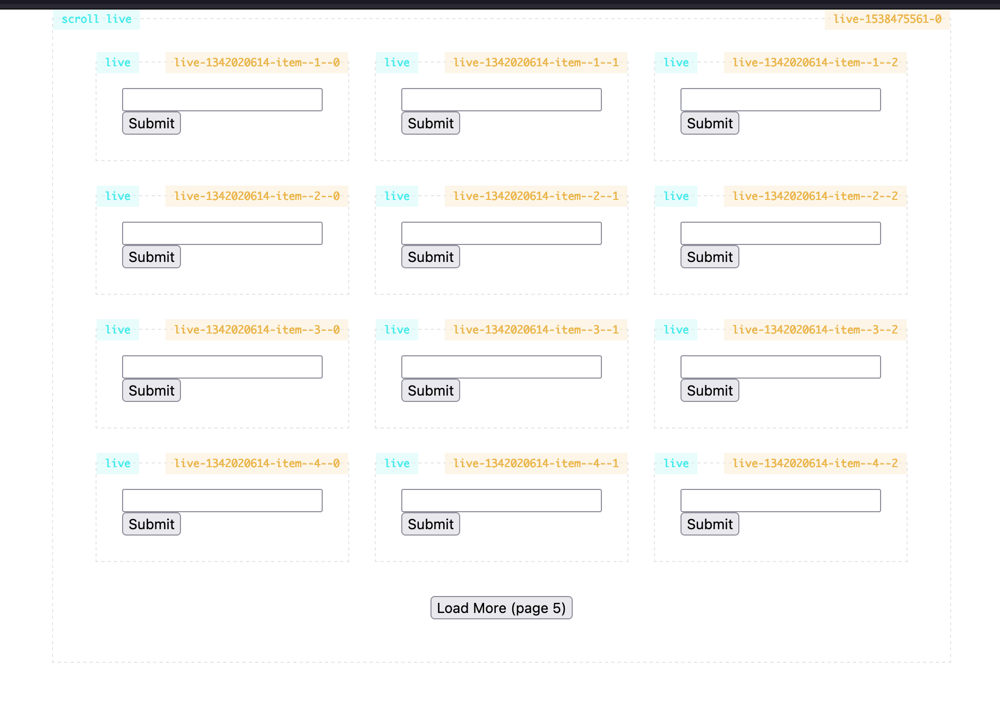

# Infinite scroll - nested


(tricky) Solution concerning the infinite scroll with nested components.

Original issue: https://github.com/symfony/ux/issues/1816

---

<p align="center">
    
</p>

## Solution

We must create the last fake ID **recursively**.

```twig

    {# 🐼🐼 Apply the same trick recursively 🐼🐼 #}

    {# ALL previous pages #}
    
    
        {# Fake page #}
        <div class="ProductGrid_page" id="page--{{ _page }}" data-live-ignore="true">
        
            {# Fake page LAST resut #}
            <article class="ProductGrid_item" id="item--{{ _page }}--{{ per_page - 1 }}"></article>
            
        </div>
        
    

```

 ## Run locally

```
composer install
symfony serve
```
